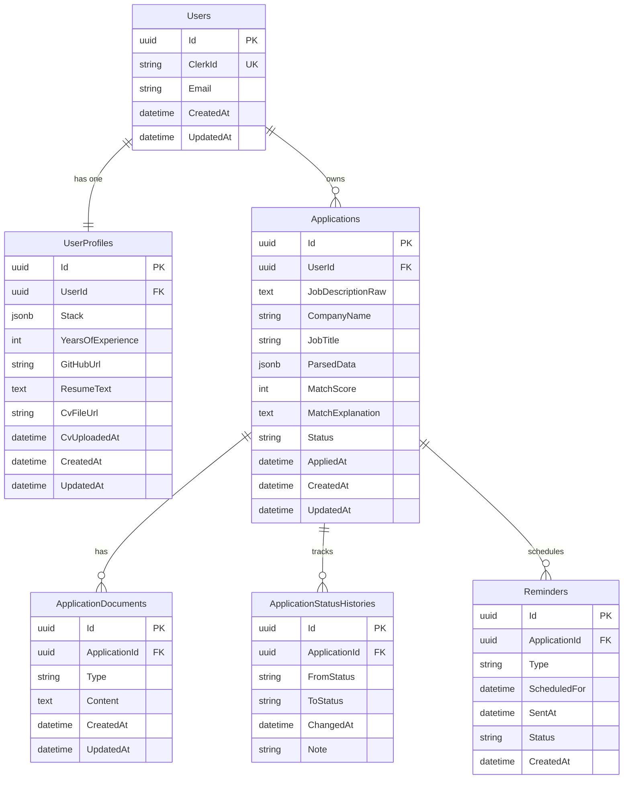
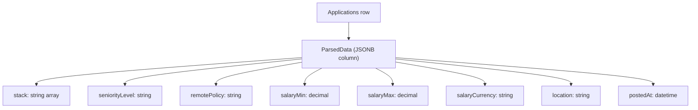
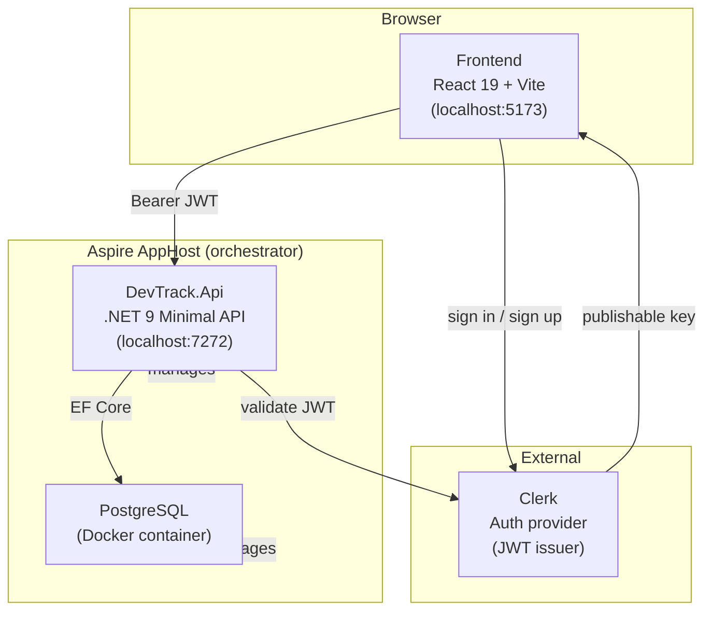
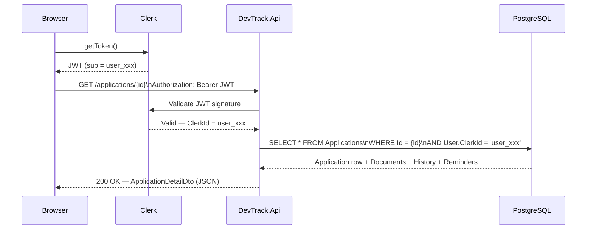
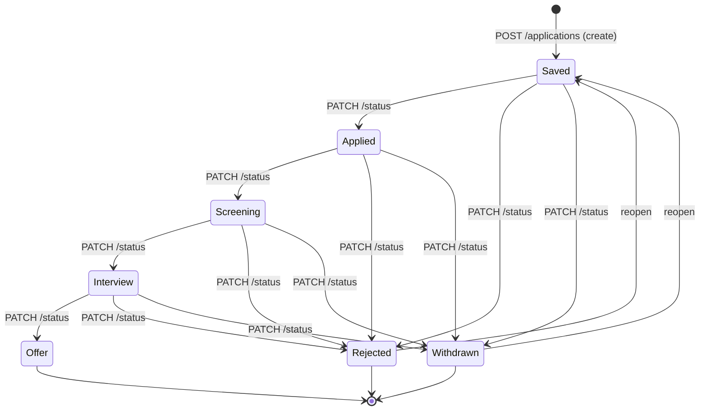
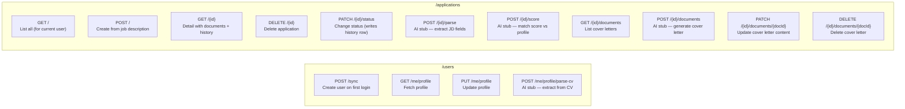
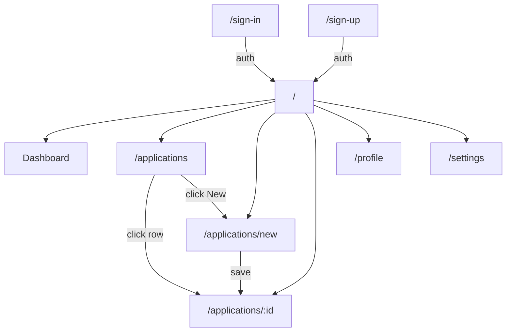

# DevTrack — Architecture & Diagrams

---

## 1. Entity-Relationship Diagram

---

## 2. ParsedData — JSONB Structure

`ParsedData` is not a separate table. It is a single JSONB column inside `Applications`.

---

## 3. System Architecture

---

## 4. Request Flow (Authenticated API Call)

---

## 5. Application Status Pipeline

Side effects triggered by `PATCH /status`:
- Any → `Applied` → sets `AppliedAt` timestamp + creates a `FollowUpPostApply` reminder (7 days later)

---

## 6. API Endpoints

---

## 7. Frontend Page Map

---

## 8. AI Stubs — Where Real AI Goes

All four stubs are in the same two files. Replace the `await Task.Delay(...)` + hardcoded return with a Claude API call.

| Endpoint | File | What AI needs to do |
|---|---|---|
| `POST /applications/{id}/parse` | `ApplicationsEndpoints.cs` | Read `JobDescriptionRaw` → extract company, title, salary, stack, location |
| `POST /applications/{id}/score` | `ApplicationsEndpoints.cs` | Compare JD stack/level with user's `ResumeText` + `Stack` → return 0–100 score + explanation |
| `POST /applications/{id}/documents` | `ApplicationsEndpoints.cs` | Read JD + user resume → generate tailored cover letter |
| `POST /users/me/profile/parse-cv` | `UsersEndpoints.cs` | Read uploaded CV text → extract stack, years, GitHub, summary |
